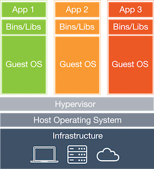
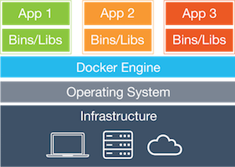
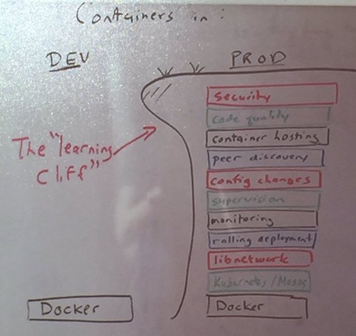
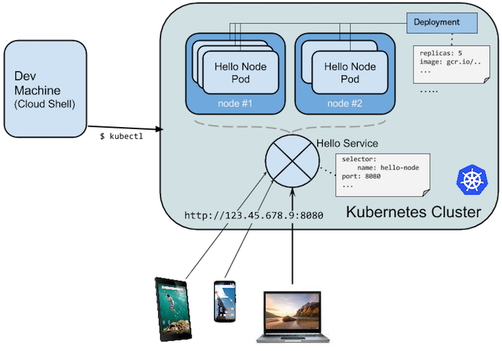

class: center, middle

# Kubernetes

Starting with Version 1.2


.right[
William Stewart]
.right[
[@zoidbergwill](github.com/zoidbergwill)]

---

# Intro

- Who am I?

- What do I do?

---

# Overview

- What is Docker?
- What is Kubernetes?
  - An overview of Kubernetes
  - Running a simple app
  - Updating it
  - How we got to version 1.2. The TL;DR
  - Cool "resources" I'm gonna have to skip over for now
- Kubernetes local development
  - Docker-compose
  - hyperkube / kubernetes-anywhere
  - localkube / minikube
- Kubernetes demo!
- War stories
  - Memcached
  - Kafka (Persistent storage, consistent broker IDs, etc. etc.)
  - Migrations
- Questions

---

# What this talk isn't

- An advanced / in-depth look at Kubernetes

  (Unfortunately we don't have the time)

  Hopefully this will be a decent foundation

- A comparison of Kubernetes vs:
  - Mesos/Marathon
  - ECS
  - Helios
  - Swarmkit

---

# What is Docker?

Docker is a simple standard way of building applications into containers, which means we can build and test the same Docker containers that we are running in production.

Containers are a lighter and more portable version of virtualisation compared to virtual machines.

.center[
 ]

---

# Running Docker in production

.center[
]

<!-- ---

## Cloud Native Computing Foundation

### About
The mission of the CNCF is to create and drive the adoption of a new computing paradigm that is optimized for modern distributed systems environments capable of scaling to tens of thousands of self healing multi-tenant nodes. You can read more in depth about our mission, structure and values in our charter: https://cncf.io/about/charter

### Projects in their incubator so far

- Kubernetes
- Prometheus -->

<!-- ---

# Things built on Kubernetes

* OpenShift by RedHat
* Gondor/Kel by Eldarion
* Deis workflow
* fabric8 -->

---

class: center, middle

# Container cluster managers
# can help

---

# Automate the boring stuff

> “Automation is a force multiplier, not a panacea”

## Value of automation
  - Consistency
  - Extensibility
  - MTTR (Mean Time To Repair)
  - Faster non-repair actions
  - Time savings

.bottom.right[
[Dan Luu's Notes on Google's Site Reliability Engineering book](http://danluu.com/google-sre-book/)]

---

# Enter Kubernetes



---

# How does it help?

- Container hosting
- Config changes
- Supervision
- Monitoring
- Rolling deployments
- Networking

---

# Let's set up a basic environment

```
$ hub clone --depth 1 zoidbergwill/docker-django-migrations-example
$ docker build -t web:1 .
$ kubectl run db --image=postgres --env="POSTGRES_PASSWORD=my-secret-pw" \
  --port 5432
deployment "db" created
$ kubectl expose deployment db
service "db" exposed
$ kubectl run web --image=web:1 --port 80 --env="POSTGRES_PASSWORD=my-secret-pw" \
  --env="QOTD=Nostalgia isn't what it used to be." --replicas 2 \
  # Or kubectl create -f k8s/web-v1-deployment.yml
deployment "web" created
$ kubectl expose deployment web --type=LoadBalancer
service "web" exposed
$ kubectl get deployments,services
NAME         DESIRED      CURRENT       UP-TO-DATE   AVAILABLE   AGE
db           1            1             1            1           1h
web          2            2             2            2           1h
NAME         CLUSTER-IP   EXTERNAL-IP   PORT(S)      AGE
db           10.0.0.100   <none>        5432/TCP     1h
kubernetes   10.0.0.1     <none>        443/TCP      2h
web          10.0.0.65                  80/TCP       1h
```

---

# Base Kubernetes resources

### `Node` (The cattle)
The machines that can have pods scheduled on them

### `Pod`
The base resource that is scheduled (We'll get into them more in a bit)

### `Service`
A simple round robin load balancer that sends traffic to pods via a selector of pod labels.

---

# Scheduling pods

### `Deployment`

- The default way to schedule a pod

e.g. API, DB, Frontend, Workers

### `DaemonSet`

- Making sure an instance of this pod runs on every node, or every node of a certain type

e.g. Logging agents, Monitoring agents, Cluster storage nodes

### `Job`

These are for once off pods.

e.g. Migrations, Batch jobs,

---

# Basic Resource template

```yaml
$ kubectl get deployment/web -o yaml
apiVersion: extensions/v1beta1
kind: Deployment
metadata:
  annotations:
    deployment.kubernetes.io/revision: "1"
  creationTimestamp: "2016-06-19T19:31:33Z"
  generation: 2
  labels:
    run: web
  name: web
  namespace: default
  resourceVersion: "2445"
  selfLink: /apis/extensions/v1beta1/namespaces/default/deployments/web
  uid: "6dfc09fe-3654-11e6-929f-9a4437171650"
spec:
  replicas: 2
  selector:
    matchLabels:
      run: web
  template: ...
status:
  availableReplicas: 2
  observedGeneration: 2
  replicas: 2
  updatedReplicas: 2
```

---

# Pods

## What
- The smallest deployable unit
- One or more containers to be scheduled together
- Each pod gets a unique internal IP

## Why
- Management (e.g. shared fate, horizontal scaling)
- Resource sharing and communication (e.g. sharing volumes, speaking on `localhost`)

## Uses
- Log ingestion
- Separating nginx from the webserver
- Local cache management

---

# Deploying a change

---

# How we got to Kubernetes 1.2

* replication controllers + services
* deployments + services
* deployments + services + secrets + configmaps + persisten volumes

---

# Resources I'm gonna ignore

* configmaps
* daemonsets (aka 'ds')
* horizontalpodautoscalers (aka 'hpa')
* ingress (aka 'ing')
* jobs
* limitranges (aka 'limits')
* persistentvolumes (aka 'pv')
* persistentvolumeclaims (aka 'pvc')
* secrets
* serviceaccounts

---

# Kubernetes local development

- docker-compose

- hyperkube

- localkube / minikube

---

# War stories

- Memcached
- Kafka (Persistent storage, consistent broker IDs, etc. etc.)
- Migrations
- Accurate local dev

---

## Questions?

## Thanks

## Links
