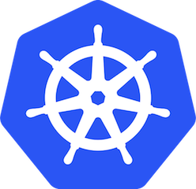

class: center, middle

# Kubernetes

Starting with Version 1.2



.left[
William Stewart]
.left[
<i class="fa fa-slack" aria-hidden="true"></i> `zoidbergwill` on [zatech](http://zatech.co.za)]
.left[
<i class="fa fa-twitter" aria-hidden="true"></i> [`zoidbergwill`](http://twitter.com/zoidbergwill)]
.left[
<i class="fa fa-github" aria-hidden="true"></i> [`zoidbergwill`](http://github.com/zoidbergwill)]

---

# Intro

- Who am I?

- What do I do?

---

# Overview

- What is Docker?
- What is Kubernetes?
  - An overview of Kubernetes
  - Running a simple app
  - Updating it
  - How we got to version 1.2. The TL;DR
  - Cool "resources" I'm gonna have to skip over for now
- Kubernetes local development
  - Docker-compose
  - hyperkube / kubernetes-anywhere
  - localkube / minikube
- Kubernetes demo!
- War stories
  - Memcached
  - Kafka (Persistent storage, consistent broker IDs, etc. etc.)
  - Migrations
- Questions

---

# What this talk isn't

- An advanced / in-depth look at Kubernetes

  (Unfortunately we don't have the time)

  Hopefully this will be a decent foundation

- A comparison of Kubernetes vs:
  - Mesos/Marathon
  - ECS
  - Helios
  - Swarmkit

---

# What is Docker?

Docker is a simple standard way of building applications into containers, which means we can build and test the same Docker containers that we are running in production.

Containers are a lighter and more portable version of virtualisation compared to virtual machines.

.center[
 ]

---

# Running Docker in production

.center[
]

<!-- ---

## Cloud Native Computing Foundation

### About
The mission of the CNCF is to create and drive the adoption of a new computing paradigm that is optimized for modern distributed systems environments capable of scaling to tens of thousands of self healing multi-tenant nodes. You can read more in depth about our mission, structure and values in our charter: https://cncf.io/about/charter

### Projects in their incubator so far

- Kubernetes
- Prometheus -->

<!-- ---

# Things built on Kubernetes

* OpenShift by RedHat
* Gondor/Kel by Eldarion
* Deis workflow
* fabric8 -->

---

class: center, middle

# Container cluster managers
# can help

---

# Automate the boring stuff

> “Automation is a force multiplier, not a panacea”

## Value of automation
  - Consistency
  - Extensibility
  - MTTR (Mean Time To Repair)
  - Faster non-repair actions
  - Time savings

.bottom.right[
[Dan Luu's Notes on Google's Site Reliability Engineering book](http://danluu.com/google-sre-book/)]

---

# Enter Kubernetes


---

# How does it help?

- Container hosting
- Config changes
- Supervision
- Monitoring
- Rolling deployments
- Networking

---

# Let's set up a basic environment

```
$ hub clone --depth 1 zoidbergwill/docker-django-migrations-example
$ docker build -t web:1 .
$ kubectl run db --image=postgres --env="POSTGRES_PASSWORD=my-secret-pw" \
  --port 5432
deployment "db" created
$ kubectl expose deployment db
service "db" exposed
$ kubectl run web --image=web:1 --port 80 --env="POSTGRES_PASSWORD=my-secret-pw" \
  --env="QOTD=Nostalgia isn't what it used to be." --replicas 2 \
  # Or kubectl create -f k8s/web-v1-deployment.yml
deployment "web" created
$ kubectl expose deployment web --type=LoadBalancer
service "web" exposed
$ kubectl get deployments,services
NAME         DESIRED      CURRENT       UP-TO-DATE   AVAILABLE   AGE
db           1            1             1            1           1h
web          2            2             2            2           1h
NAME         CLUSTER-IP   EXTERNAL-IP   PORT(S)      AGE
db           10.0.0.100   <none>        5432/TCP     1h
kubernetes   10.0.0.1     <none>        443/TCP      2h
web          10.0.0.65                  80/TCP       1h
```

---

# The building blocks

### `Node`

- Containers have to run somwehere

- All machines that talk to the Kubernetes API Server, and can have pods
scheduled on them

- They can have unique `label`s which can be useful, for different sized
  boxes, or guaranteeing `Pod`s run on certain `Node`s.

- Whether it's AWS, DigitalOcean, GCP, or your own tin, they're destined
  to die some day.

---

# The building blocks

### `Pod`

- The base resource that is scheduled

- It is destined to be re-scheduled, updated, or destroyed.

We're gonna touch more on them in a bit, because `Pod`s and `Service`s
are the main power of Kubernetes.

---

# The building blocks

### `Service`

- Simple load balancers that use a selection of labels to route traffic to
pods.

- They all have the following:
  - `selector` for finding pods to forward the traffic.
  - `clusterIP` since we have to hit the load balancer somehow
  - `ports` to send the traffic from and to.
  - Potentially more...
---

## Scheduling Pods

### `Deployment`

The default way to schedule a pod

e.g. API, DB, Frontend, Workers

### `DaemonSet`

Making sure an instance of this pod runs on every node, or every node of a certain type

e.g. Logging agents, Monitoring agents, Cluster storage nodes

### `Job`

These are for once off pods.

e.g. Migrations, Batch jobs,

### `ReplicationController`

The old default way of scheduling pods...

---

# Basic Resource template

```yaml
$ kubectl get deployment/web -o yaml
apiVersion: extensions/v1beta1
kind: Deployment
metadata:
  annotations:
    deployment.kubernetes.io/revision: "1"
  creationTimestamp: "2016-06-19T19:31:33Z"
  generation: 2
  labels:
    run: web
  name: web
  namespace: default
  resourceVersion: "2445"
  selfLink: /apis/extensions/v1beta1/namespaces/default/deployments/web
  uid: "6dfc09fe-3654-11e6-929f-9a4437171650"
spec:
  replicas: 2
  selector:
    matchLabels:
      run: web
  template: ...
status:
  availableReplicas: 2
  observedGeneration: 2
  replicas: 2
  updatedReplicas: 2
```

---

# Pods

## What are they?
- The smallest deployable unit
- One or more containers to be scheduled together
- Each pod gets a unique internal IP

## Why more than one container?
- Management (e.g. shared fate, horizontal scaling)
- Resource sharing and communication (e.g. sharing volumes, speaking on `localhost`)

## Uses
- Log ingestion
- Separating nginx from the webserver
- Local cache management

---

# Fun with labels on `Pod`s

## Canary deployments / AB testing

### Deployments / Pods

```yaml
name: frontend
replicas: 3
...
labels:
  app: guestbook
  tier: frontend
  track: stable
...
image: gb-frontend:v3
---
name: frontend-canary
replicas: 1
...
labels:
  app: guestbook
  tier: frontend
  track: canary
...
image: gb-frontend:v4
```

### Service

```yaml
selector:
  app: guestbook
  tier: frontend
```

---

# More Fun with `Pod`s

## Orphan'ing a pod

### Deployments / Pods

The canary is acting up.

Let's make sure it doesn't get scaled down in an update:

```yaml
name: frontend-canary
...
labels:
  track: canary
...
image: gb-frontend:v4
```

### Service

```yaml
selector:
  app: guestbook
  tier: frontend
```

---

# How we got to Kubernetes 1.2

- `ReplicationController`s `kubectl rolling-update` to new image tags, which
  directly created `Pod`s
- `Deployment`s creating `ReplicaSet`s with hashes of the pod spec which go on
  to create `Pod`s, and we can `kubectl rollout undo`
- Factor config out into `Secret`s and `ConfigMap`s, and load values from them
  into `Deployment`s

---

# Deployment with a simple pod spec

```yaml
apiVersion: extensions/v1beta1
kind: Deployment
metadata:
  ...
  name: web
spec:
  ...
  template:
    metadata:
      creationTimestamp: null
      labels:
        run: web
    spec:
      containers:
      - env:
        - name: POSTGRES_PASSWORD
          value: my-secret-pw
        - name: QOTD
          value: Nostalgia isn't what it used to be.
        - name: MY_POD_IP
          valueFrom:
            fieldRef:
              fieldPath: status.podIP
        image: web:1
        name: web
        ports:
        - containerPort: 80
        resources: {}
status: {}
```

---

# A more fancy pod spec

```yaml
spec:
  ...
  template:
      ...
    spec:
      containers:
      - env:
        - name: POSTGRES_PASSWORD
          valueFrom:
            secretKeyRef:
              name: postgres
              key: password
        - name: QOTD
          valueFrom:
            configMapKeyRef:
              name: qotd
              key: january
        - name: MY_POD_IP
          valueFrom:
            fieldRef:
              fieldPath: status.podIP
        livenessProbe:
          httpGet:
            path: /healthz
            port: 80
            scheme: HTTP
          initialDelaySeconds: 30
          timeoutSeconds: 5
        image: web:1
        name: web
        ports:
        - containerPort: 80
```

---

# Separate `ConfigMap` & `Secret`

`qotd-configmap.yml`:

```yaml
apiVersion: v1
data:
  january: "Nostalgia isn't what it used to be."
  february: Richard Stallman exists because he compiled himself into being.
kind: ConfigMap
metadata:
  name: qotd
  namespace: default
```

`postgres-secret.yml`:

```yaml
apiVersion: v1
data:
  # echo "my-secret-pw" | base64
  password: bXktc2VjcmV0LXB3Cg==
kind: Secret
metadata:
  name: postgres
type: Opaque
```

---

# Resources I'm gonna ignore

### horizontalpodautoscalers (aka 'hpa')

`kubectl autoscale deployment foo --min=2 --max=10  --cpu-percent=80`

### ingress (aka 'ing')

> Ingress is a collection of rules that allow inbound connections to reach
> the endpoints defined by a backend. An Ingress can be configured to give
> services externally-reachable urls, load balance traffic, terminate SSL,
> offer name based virtual hosting etc.

### limitranges (aka 'limits')

These allow setting namespace-wide resource-specific limit ranges.

### persistentvolumeclaims (aka 'pvc')

These are an interesting abstraction on top of peristent volumes.

---

# Kubernetes local development

- docker-compose (Not really accurate)

- hyperkube (Running a single-node cluster in docker-machine/locally)

- localkube / minikube (Officlal github.com/kubernetes/minikube)
  There was:
    - boot2kube/kmachine/kcompose
    - monokube
    - localkube

```markdown
## Primary Goals

From a high level the goal is to make it easy for a new user to run a
Kubernetes cluster and play with curated examples that require least
amount of knowledge about Kubernetes.
These examples will only use kubectl and only a subset of Kubernetes
features that are available will be exposed.

- Works across multiple OSes - OS X, Linux and Windows primarily.
- Single command setup and teardown UX.
- Unified UX across OSes
- Minimal dependencies on third party software.
- Minimal resource overhead.
- Eliminate any other alternatives to local cluster deployment.
```

[local cluster UX
proposal](https://github.com/kubernetes/kubernetes/blob/master/docs/proposals/local-cluster-ux.md)

---

# War stories

- Memcached
- Kafka
- Migrations
- Accurate local dev

---

# Memcached and Me being dumb

---

# Kafka

- tutorials make running zookeeper/kafka easy
- they cheat

Pods are disposable

- Kafka v.0.9 can auto assign broker IDs, which seems useful for
  disposable pods, but it breaks when using another broker IDs storage
  volume.

- Google/AWS persistent disks are well-supported, but not really with
  replication controllers / replica sets / deployments.

- Peer discovery is also hard

---

# Migrations

- Distributed systems are hard.
- Schema changes are hard.
- Rolling updates to distributed systems with schema changes are hard

---

class:center

[](http://cultofthepartyparrot.com)

## Thanks, Questions, and Sauce

<i class="fa fa-github" aria-hidden="true"></i> [Slides](https://zoidbergwill.github.io/presentations/2016/kubernetes-1.2-and-spread/) [Code](https://github.com/zoidbergwill/kubernetes-examples)

---

## Things you should read

https://danluu.com/google-sre-book

https://queue.acm.org/detail.cfm?id=2898444/

https://kubernetes.io/docs/getting-started-guides/docker/

https://kubernetes.io/docs/user-guide/ui/

https://cncf.io/community

https://github.com/kubernetes/kubernetes-anywhere/

https://github.com/kubernetes/minikube

https://github.com/ramitsurana/awesome-kubernetes
