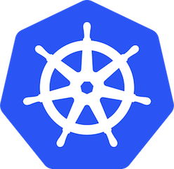
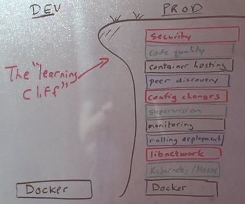

class: center, middle

# Adventures with Laravel and Kubernetes

### at superbalist.com



.left[
William Stewart]
.left[
[<i class="fa fa-slack" aria-hidden="true"></i> zatech](http://zatech.co.za)]
.left[
[<i class="fa fa-twitter" aria-hidden="true"></i>](http://twitter.com/zoidbergwill)]
.left[
[<i class="fa fa-github" aria-hidden="true"></i>](http://github.com/zoidbergwill)]
.left[
<i class="fa fa-pied-piper-pp" aria-hidden="true"></i> `zoidbergwill` basically everywhere]
---

# Intro

## Who am I?

## What do I do?

---

# Overview

### Docker

- What is Docker?
- Why do we use it?

### Kubernetes

- What is Kubernetes?
- Why do we use it?

### Some extra tools

### A quick demo

### War stories

- Logging
- Signal propagation
- Long running processes
- Schema changes

---

# Docker

.center[
  ]

---

# What is Docker?

<!--.center[-->
<!-- ]-->
.center[
  ]

---

# How does it help?

- Language agnostic build artifact

```
FROM composer:alpine
COPY composer.json composer.lock /app
RUN composer install --ansi --no-interaction --no-scripts --no-dev --no-autoloader
COPY . /app
RUN composer install
```

.center[
or]

```
FROM node:alpine
COPY package.json /app
RUN npm install
COPY . /app
```

---

# How does it help?

- No more "works on my machine", because they're the same images locally
  and on production

- Smaller shippable artifacts than full machine images, and easier to
  independently scale components

- A lot of useful services already in the Docker registry:
  - MySQL
  - Redis
  - Memcached
  - Elastic Search
  - RabbitMQ

---

# Running Docker in production

.center[
]

---

# How does it help?

### - Container hosting
### - Config changes
### - Supervision
### - Monitoring
### - Rolling deployments
### - Networking / Service discovery
### - and more...

---

# Automate the boring stuff

> “Automation is a force multiplier, not a panacea”

## Value of automation
  - Consistency
  - Extensibility
  - MTTR (Mean Time To Repair)
  - Faster non-repair actions
  - Time savings

.bottom.right[
[Dan Luu's Notes on Google's Site Reliability Engineering book](http://danluu.com/google-sre-book/)]

---

.center[
  # What is Kubernetes?

  <br>
  <br>

  ## an open source container
  ## cluster manager
]

---

# How does it help?

- Faster/smarter builds than a .tar.gz
- Reliable rolling updates (safer than a symlink swap)
- Similar build/deploy scripts for all languages and services
- Autoscaling (based on CPU usage)
- Fine-grained healthchecking
- Accurate resource monitoring and better usage

---

## This allows us to easily move towards SOA,

- Easily start new projects in any language, that can rely on the same service discovery (using DNS)

  - Discovery via DNS (`curl http://elasticsearch/`) or automatically set Kubernetes environment variables (`env('ELASTICSEARCH_SERVICE_HOST')`), that balances load over a collection of Elastic Search clients, all automatically updated by Kubernetes.

  - A huge collection of base Dockerfiles on hub.docker.com and quay.io

---

## Avoid "works on my machine" issues

- Accurately replicate most of our production environment locally
  (other than a mocked Google Loadbalancer)

- Using:
  - minikube, which behaves like a single-node Kubernetes cluster
  - docker, moving towards rocker, to better utilise global Composer/NPM cache
  - NFS, to allow faster feedback when developing
  - some `bash` glue

---

## Easily implement monitoring, logging, and LetsEncrypt

- Simply implement metrics monitoring and LetsEncrypt using Kubernetes annotations:

  ```
  annotations:
    prometheus.io/port: "9150"
    prometheus.io/scrape: "true"
  ```

  ```
  apiVersion: extensions/v1beta1
  kind: Ingress
  metadata:
    annotations:
  *    kubernetes.io/ingress.class: gce
  *    kubernetes.io/tls-acme: "true"
    name: general-ingress
  spec:
    rules:
    - host: tasks.zoidbergwill.com
      http:
        paths:
        - backend:
            serviceName: tasks-app
            servicePort: 80
          path: /
    tls:
    - hosts:
      - tasks.zoidbergwill.com
      secretName: tasks-tls
    ```

---

# Demo tools

[Minikube](https://github.com/kubernetes/minikube)

[Rocker](https://github.com/grammarly/rocker)

[Kube-lego](https://github.com/jetstack/kube-lego)

---
.center[

# DEMO

.center[
  
  
]
.center[
  
  
]

# DEMO

]

---

# War stories

---

## Logging

- Logging to a file worked great on compute engine with fluentd

- Gcloud Stackdriver Logging is pretty amazing, but with container engine it wants `stdout`

```
± ag log tasks/config/app.php
112:    | Logging Configuration
115:    | Here you may configure the log settings for your application. Out of
116:    | the box, Laravel uses the Monolog PHP logging library. This gives
117:    | you a variety of powerful log handlers / formatters to utilize.
119:    | Available Settings: "single", "daily", "syslog", "errorlog"
123:    'log' => env('APP_LOG', 'single'),
125:    'log_level' => env('APP_LOG_LEVEL', 'debug'),
212:        'Log' => Illuminate\Support\Facades\Log::class,
```

---

## Logging Monolog/Laravel options

`single`/`daily` file:
  - doesn't go to stdout and get consumed by `fluentd-cloud-logging`

`syslog`:
  - another dependency, and we'd need to install syslog and tail it, or talk to an external syslog daemon

`errorlog`:
  - `php-fpm` logs have a prefix you can't get rid of
  - Bubbling them to the nginx container also has a gross prefix and means you can't separate the logs for each container

---

## Upstream php images also do some gross logging stuff

```
FROM php:7-fpm
```

```
[global]
error_log = /proc/self/fd/2

[www]
access.log = /proc/self/fd/2
```

Access logs are junk for Laravel:

`127.0.0.1 - 07/Feb/2017:13:57:57 +0000 "GET /index.php" 200` (x 1337)

error_log can be pretty crap too:

```
[07-Feb-2015 11:46:44] WARNING: [pool www] child 32465 said into stderr: "NOTICE: PHP message: Array"
[07-Feb-2015 11:46:44] WARNING: [pool www] child 32465 said into stderr: "("
[07-Feb-2015 11:46:44] WARNING: [pool www] child 32465 said into stderr: "     [6] => 363"
[07-Feb-2015 11:46:44] WARNING: [pool www] child 32465 said into stderr: ")"
[07-Feb-2015 11:46:44] WARNING: [pool www] child 32465 said into stderr: ""
```

---

## Going full circle

```
> cat entrypoint.sh
# Tail a log file, and background that process
tail -f /var/www/html/storage/logs/laravel.log &
# Now run the more important piece
php-fpm7
```

---

## Signal propagation

Linux relies on PID 1 doing important stuff, that an init system does

Most Docker entrypoints use `exec` to become the main process, but this kills anything running in the script.

Shells (like `bash`) don't propagate signals, like `SIGTERM` or `SIGQUIT`, which messes with graceful shutting down.

When a pod dies:
  - PID 1 in the container gets a `SIGTERM` and given a grace period (default: 30s) to shutdown by default
  - Once the grace period has expired then a `SIGKILL` signal is sent

`dumb-init` and lifecycle hooks to the rescue!

dumb-init wraps your `ENTRYPOINT` shell script and makes sure signals propagate to child processes

```
lifecycle:
  preStop:
    exec:
      # SIGTERM triggers a quick exit; gracefully terminate instead
      command: ["/usr/sbin/nginx","-s","quit"] # or php artisan queue:restart
```

---

## Cron

If you run plain old `cron` it runs processes in a separate env, so we dump our Kubernetes environment for `phpdotenv` to read:

```
# Cron is a bastard that has sub processes with different env vars.
env > .env
sed -i -e "s/=\(.*\)$/=\"\1\"/g" .env
```

---

## Long running processes

The max "grace period" for a pod is 5 minutes.

Easy steps in the right direction:

- Break tasks up as small as possible
- Put most tasks on queues
- Use Kubernetes "Jobs" when forced to

---

## Database migrations

Three step DB Migrations

Migrating before starting a rolling update

---

class:center, middle

## Superbalist.com and Takealot.com are hiring!!!

## Source

[<i class="fa fa-github" aria-hidden="true"></i> Code](https://github.com/zoidbergwill/kubernetes-php-examples)

Slides: [www.zoidbergwill.com/presentations/2017/kubernetes-php/](https://zoidbergwill.github.io/presentations/2017/kubernetes-php/)

---

## Links  

- O'Reilly's Site Reliability Engineering: How Google Runs Production Systems
  [Amazon](http://www.amazon.com/Site-Reliability-Engineering-Production-Systems-ebook/dp/B01DCPXKZ6/)

- Dan Luu's [notes](https://danluu.com/google-sre-book) are good too

- Borg, Omega, and Kubernetes
  Lessons learned from three container-management systems over a decade.
  [Essay](https://queue.acm.org/detail.cfm?id=2898444)

- [`kubernetes-dashboard`](https://kubernetes.io/docs/user-guide/ui/)

- [Cloud Native Computing Foundation](https://cncf.io/community)

- [Kubernetes-Anywhere](https://github.com/kubernetes/kubernetes-anywhere/): An official Kubernetes repo with some documentation on running Kubernetes with Docker for Mac beta

- [`minikube`](https://github.com/kubernetes/minikube): The official Go
  binary for running a simpler local cluster.

- [`awesome-kubernetes`](https://github.com/ramitsurana/awesome-kubernetes)
  list on GitHub, cuz it has some neat things.

- [Docker and the PID 1 reaping problem](https://blog.phusion.nl/2015/01/20/docker-and-the-pid-1-zombie-reaping-problem/)

- [Containers really are the future](https://circleci.com/blog/it-really-is-the-future/)
