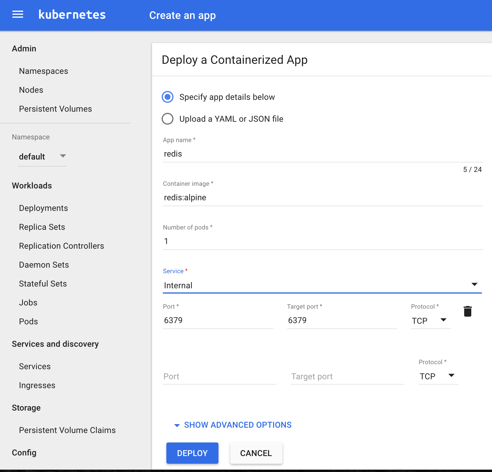

.center[

# Superbalist and Kubernetes

## A journey


]

.left[
  William Stewart (@zoidbergwill)
]

---

# Who Am I


---

# Who Am I Really

.center[
  
]

### William Stewart

#### Site Reliability and DevOps at Superbalist.com

- Only cried about Docker Inc. ~~6~~ 7 times
- Plays french horn and has a fixed gear bicycle
- Denies being a hipster
- Yes, I know DevOps isn't supposed to be a person or a team

---

# Who is Superbalist

.center[
  
]

- The number 1 fashion destination for 18-35 year olds.
- We send lots of e-mails (You can unsubscribe).
- We didn't go down on Black Friday.

---

# Black Friday 2015

- monolithic codebase with one or two other services
- 30+ individual servers on Google Cloud Platform
- new service meant `n` new servers
- lots of machines using less than 30% of resources, even at peak

---

# No need to waste

```
memcached                         160m           609Mi
redis                               3m             1Mi
memcached                           1m           112Mi
memcached                           0m            28Mi
...
rabbitmq                           21m           108Mi
```

```
NAME                                   CPU%   MEMORY%
gke-hive-swimming-pool-d0bbd64a-acc9   41%    69%
gke-hive-swimming-pool-d0bbd64a-ee07   40%    57%
...
gke-hive-swimming-pool-d0bbd64a-woun   18%    53%
```

---

# 2016 and beyond

- move to service orientated architecture
- less than 20 servers
- 15+ services
- 80% into Kubernetes
- much more efficient resource usage
- Simpler scaling

---

class: center, middle

# Black Friday (in the war room)

```
$ gcloud container clusters resize hive --size="one billion"
$ kubectl scale deployment/website --replicas 500
```

---

# The journey so far

**2015 November**
- First commit related to Kubernetes

**2016 February**
- All new services, and some stateful stuff into Kubernetes
- Some attempts at bash substitution, `sed`, and `envsubst` for
  templating deploys.

**2016 July**
- Monolithic repo into Kubernetes in staging

**2016 Aug**
- Local dev into Minikube and move to Jinja2 CLI

**2016 November**
- Monolithic repo into Kubernetes in production

**2017 March**
- Going forward

---

# What is Docker?

.center[
 
]

---

# What Docker gives us?

- Language agnostic build artifacts
- Simple `Dockerfile` which stores the recipe for an artifact with smart
  build caching


```
FROM python:alpine
ADD src/requirements.txt .
RUN pip install -r requirements.txt --no-cache-dir
ADD src .
CMD ["gunicorn", "-w", "4", "-b", "0.0.0.0:5000", "app:main"]
```

---

# three column image of caching

```
FROM python:alpine
ADD src/requirements.txt .
RUN pip install -r requirements.txt --no-cache-dir
ADD src .
CMD ["gunicorn", "-w", "4", "-b", "0.0.0.0:5000", "app:main"]
```

```
FROM python:alpine
ADD src/requirements.txt .
RUN pip install -r requirements.txt --no-cache-dir
*ADD src .
*CMD ["gunicorn", "-w", "4", "-b", "0.0.0.0:5000", "app:main"]
```

```
FROM python:alpine
*ADD src/requirements.txt .
*RUN pip install -r requirements.txt --no-cache-dir
*ADD src .
*CMD ["gunicorn", "-w", "4", "-b", "0.0.0.0:5000", "app:main"]
```

---

class: center, middle

# What is Kubernetes?


.bottom.center[
  
]

---

# A Kubernetes Overview


---

# Kubernetes

- Gives you the primitives to declare:
  - Apps which do rolling updates controlled by Kubernetes
  - Loadbalancers that do service discovery and balance load over
    healthy versions of the apps
  - Run apps on every single node in your cluster

- Native support for cloud providers, for storage and external
  IPs.

---

# Quickstart on GCP

Once you've installed the google cloud sdk

## Set up a cluster

```
$ gcloud container clusters create pleiades
$ gcloud container clusters get-credentials pleiades
$ kubectl config use-context gke_zoidbergwill-php-meetup_europe-west1-d_pleiades
```

---

# Running an example app

## GUI

 

---

# Running an example app

### CLI

```
$ kubectl run redis --image=redis --expose=true --port=6379
service "redis" created
deployment "redis" created
$ kubectl run docker-counter --image=tuna/docker-counter23 --replicas --port=5000
deployment "docker-counter" created
$ kubectl expose deploy/docker-counter --type LoadBalancer
service "docker-counter" exposed
$ kubectl get svc/docker-counter -w
$ kubectl get deploy,svc,po -o wide
NAME                    DESIRED   CURRENT   UP-TO-DATE   AVAILABLE   AGE
deploy/docker-counter   5         5         5            5           2m
deploy/redis            1         1         1            1           1m

NAME                                 READY     STATUS    RESTARTS   AGE       IP           NODE
po/docker-counter-1427949298-4zwgn   1/1       Running   0          2m        172.17.0.8   minikube
po/docker-counter-1427949298-6nsqc   1/1       Running   0          2m        172.17.0.6   minikube
po/docker-counter-1427949298-7c9k0   1/1       Running   0          2m        172.17.0.7   minikube
po/docker-counter-1427949298-r99q3   1/1       Running   0          2m        172.17.0.9   minikube
po/docker-counter-1427949298-tsm6t   1/1       Running   0          2m        172.17.0.5   minikube
po/redis-1148828176-pfbpb            1/1       Running   0          1m        172.17.0.4   minikube

NAME                 CLUSTER-IP   EXTERNAL-IP   PORT(S)          AGE       SELECTOR
svc/docker-counter   10.0.0.143   <pending>     5000:32204/TCP   2m        run=docker-counter
svc/redis            10.0.0.135   <none>        6379/TCP         1m        run=redis
```

---

# Dev vs Ops experience

Similar to `docker` UX:

`kubectl run`

`kubectl logs`

`kubectl cp`

`kubectl exec`

---

# Tools we use

- docker
- gcloud
- kubectl
- Jinja2
- minikube
- stern

---

# Deployment evolution

- envsubst

- sed
  ```
  DEPLOYED_IMAGE_URL="$(kubectl get pods -l app=api -o=jsonpath='{.items[0].spec.containers[0].image}')"
  NEW_DEPLOYMENT=$(kubectl get deployment/api -o yaml)
  NEW_DEPLOYMENT=$(echo "${CURRENT_DEPLOYMENT}" | sed "s@image: ${DEPLOYED_IMAGE_URL}@image: ${NEW_IMAGE_URL}@")
  echo "${CURRENT_DEPLOYMENT}" | kubectl apply -f -
  ```

- jinja2 (with j2-cli)


---

# Local dev evolution

---


# Struggles

- Kafka and storage in general
- Migrations
- Accurate local dev
- Logging
- Cron and long running processes
- Signal propagation
- Init systems

---

# Epilogue
