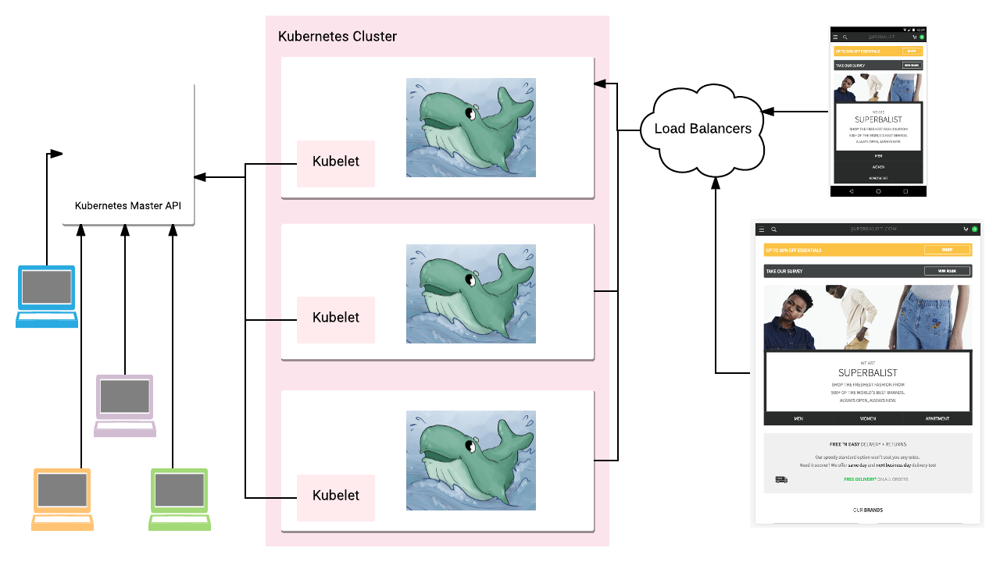
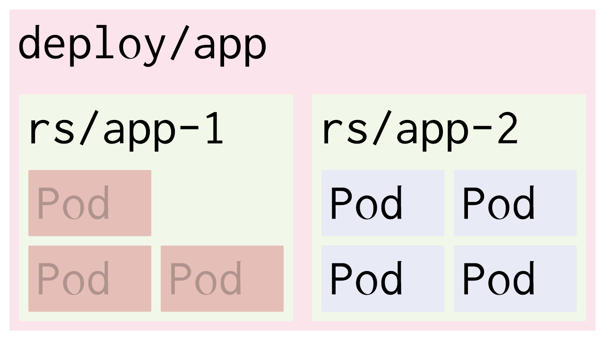

.center[

# Superbalist and Kubernetes

## A journey


]

.left[
  William Stewart (@zoidbergwill)
]

---

# Who Am I


---

# Who Am I Really


### William Stewart

#### Site Reliability and DevOps Team at Superbalist.com

- Only cried about Docker Inc. ~~6~~ 7 times
- Plays French Horn and rides a fixie
- Denies being a hipster
- Yes, I know DevOps isn't supposed to be a person or a team

---

# Who is Superbalist

.center[
  
]

---

class: center

# Black Friday 2015

<br>

## <i class="fa fa-shopping-basket" aria-hidden="true"></i> <i class="fa fa-shopping-basket superb" aria-hidden="true"></i> <i class="fa fa-shopping-basket" aria-hidden="true"></i> <i class="fa fa-shopping-basket superb" aria-hidden="true"></i> <i class="fa fa-shopping-basket" aria-hidden="true"></i> <i class="fa fa-shopping-basket superb" aria-hidden="true"></i> <i class="fa fa-shopping-basket" aria-hidden="true"></i> <i class="fa fa-shopping-basket superb" aria-hidden="true"></i> <i class="fa fa-shopping-basket" aria-hidden="true"></i> <i class="fa fa-shopping-basket superb" aria-hidden="true"></i> <i class="fa fa-shopping-basket" aria-hidden="true"></i> <i class="fa fa-shopping-basket superb" aria-hidden="true"></i>

<br>

## <i class="fa fa-building" aria-hidden="true"></i> 4 services
## <i class="fa fa-server" aria-hidden="true"></i> ±30 servers

<br>

## <i class="fa fa-shopping-basket superb" aria-hidden="true"></i> <i class="fa fa-shopping-basket" aria-hidden="true"></i> <i class="fa fa-shopping-basket superb" aria-hidden="true"></i> <i class="fa fa-shopping-basket" aria-hidden="true"></i> <i class="fa fa-shopping-basket superb" aria-hidden="true"></i> <i class="fa fa-shopping-basket" aria-hidden="true"></i> <i class="fa fa-shopping-basket superb" aria-hidden="true"></i> <i class="fa fa-shopping-basket" aria-hidden="true"></i> <i class="fa fa-shopping-basket superb" aria-hidden="true"></i> <i class="fa fa-shopping-basket" aria-hidden="true"></i> <i class="fa fa-shopping-basket superb" aria-hidden="true"></i> <i class="fa fa-shopping-basket" aria-hidden="true"></i>

---

# HA can mean wasted resources

<br>

.center[
  <i class="fa fa-tasks" style="font-size: 400px;" aria-hidden="true"></i>
]

---

# 2016 and beyond

## <i class="fa fa-building" aria-hidden="true"></i> ±15 services
## <i class="fa fa-server" aria-hidden="true"></i> &lt;20 servers
## ⎈ 80% into Kubernetes

---

class: center, middle

# Black Friday (in the war room)

```
$ gcloud container clusters resize hive --size="one billion"
$ kubectl scale deployment/website --replicas 500
```

---

# The journey so far

## 2015 November
- First commit related to Kubernetes

## 2016 February
- All new services, and some stateful stuff into Kubernetes
- Some attempts at bash substitution, `sed`, and `envsubst` for
  templating deploys.

---

# The journey so far (Cont.)

## 2016 July
- Monolithic repo into Kubernetes in staging

## 2016 Aug
- All local dev into Minikube and move to Jinja2 CLI

---

# The journey so far (Cont.)

## 2016 November
- Monolithic repo into Kubernetes in production

## 2017 March
- Going forward

---

# What is Docker?

.center[
 
]

---

# What Docker gives us?

## The `Dockerfile`

```
FROM python
ADD src/requirements.txt .
RUN pip install -r requirements.txt --no-cache-dir
ADD src .
```

---

# Docker build caching

## Adding a requirement

```
FROM python
*ADD src/requirements.txt .
*RUN pip install -r requirements.txt --no-cache-dir
*ADD src .
```

## Editing source code

```
FROM python
ADD src/requirements.txt .
RUN pip install -r requirements.txt --no-cache-dir
*ADD src .
```

---

class: center, middle

# What is Kubernetes?


.center[
  
]

---

# A Kubernetes Overview



---

# Kubernetes

- Gives you the primitives to declare:
  - Apps which do rolling updates controlled by Kubernetes
  - Loadbalancers that do service discovery and balance load over
    healthy versions of the apps
  - Run apps on every single node in your cluster

- Native support for cloud providers, for storage and external
  IPs.

---

# Running an example app


---

# Kubernetes Primitives: Deployments



---

# Kubernetes Primitives: Services

## A/B testing

## Rolling updates

## Canaries

---

# Dev vs Ops experience

---

# Tools we use

## docker
## gcloud
## kubectl
## Jinja2
## minikube
## stern

---

# Deployment evolution

## sed
  ```
  sed "s@image: ${DEPLOYED_IMAGE_URL}@image: ${NEW_IMAGE_URL}@"
  ```
## envsubst
  ```
  envsubst deployment.yml.template
  ```

## jinja2 (with j2-cli)

---

# Local dev evolution

## docker-compose

## hyperkube

## minikube

---

## Ephemeral containers

---

## Build-time secrets

---

## Storage volumes

All the docs are a lie.

---

## Migrations

Not a container problem, just a distributed systems one.

---

## Logging

---

## Cron and long running processes

---

## Signal propagation and init systems

---

# Questions

[zoidbergwill.github.io/presentations/2017/kubernetes-scaleconf/](zoidbergwill.github.io/presentations/2017/kubernetes-scaleconf/)
