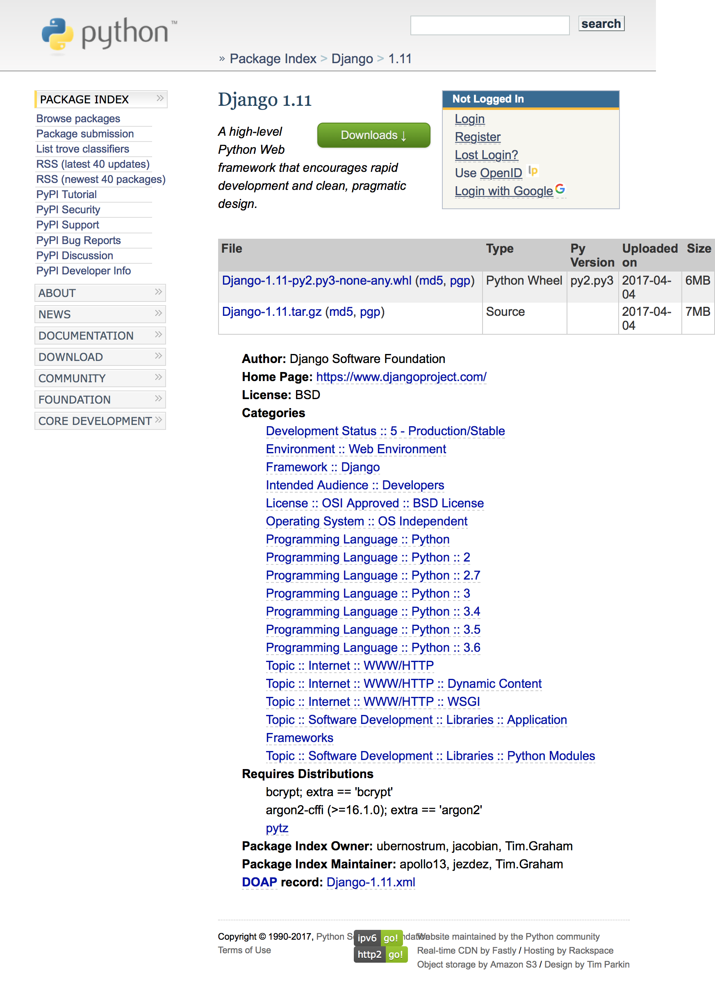
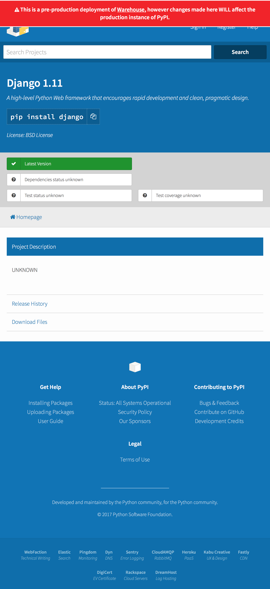
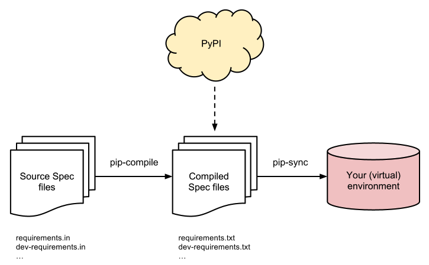

class: center, inverted, middle, title

# Python Packaging

## Wheels, pip, PyPI, and more...

by `@zoidbergwill`

---

layout:true 

# Life Before Pip

---

## Python 2 and `easy_install`

```bash
wget -O /tmp/get-pip.py 'https://bootstrap.pypa.io/get-pip.py' \
    && python2 /tmp/get-pip.py "pip==9.0.1" \
    && rm /tmp/get-pip.py
pip install django
```

---

## Python 3 and `pip`

```
pip install django
```

---

## PyPI and eggs

https://pypi.python.org/pypi



---

layout: true

# Where We Are

---

```bash
pip install -U pip setuptools wheel
```
## Pip

> HTTP caching
> Binary wheel building and caching

---

## Wheels (Pip 8.1 and later)

> Many packages will be properly installed with only the "Unpack" step (simply extracting the file onto sys.path), and the unpacked archive preserves enough information to "Spread" (copy data and scripts to their final locations) at any later time.

## ManyLinux

> The goal of the manylinux project is to provide a convenient way to distribute binary Python extensions as wheels on Linux. This effort has produced PEP 513 which defines the manylinux1_x86_64 and manylinux1_i686 platform tags.

> The manylinux1 tags allow projects to distribute wheels that are automatically installed (and work!) on the vast majority of desktop and server Linux distributions.

---

## Twine

> Verified HTTPS Connections

> Uploading doesn't require executing setup.py

> Uploading files that have already been created, allowing testing of distributions before release

> Supports uploading any packaging format (including wheels).

---

## A Packaging Guide

https://packaging.python.org/

---

layout: true

# Where We're Going
## Pipfile

---

### `Pipfile`

```bash
[[source]]
url = "https://pypi.python.org/simple"
verify_ssl = true

[packages]
Django = "*"
```

---

### `Pipfile.lock`

```bash
{
    "_meta": {
        "hash": {
            "sha256": "cb65967bdf3a7372749ce6144be4ee63f412aeeac624342fda3a2b58b1c43c15"
        },
        "requires": {},
        "sources": [
            {
                "url": "https://pypi.python.org/simple",
                "verify_ssl": true
            }
        ]
    },
    "default": {},
    "develop": {}
}
```

---

layout: true

# Where We're Going

---

## Warehouse

https://pypi.org/



---

layout: false

# Tools You'll Need

## Setuptools

## Wheel

## Twine

---

# The Library to be Distributed

## Minimum

```bash
setup.py
<your package>
```

## More Commonly

```bash
setup.py
setup.cfg
README.rst
MANIFEST.in
<your package>
```

---

layout: true

# Alternatives to Pipfile

---

## pip-tools



---

## A Better Pip Workflow

```bash
rm requirements.txt
virtualenv/bin/pip install \
  -r requirements-to-freeze.txt \
  --upgrade
virtualenv/bin/pip freeze > requirements.txt
```

```bash
$ cat requirements-to-freeze.txt
django
```

```bash
$ cat requirements.txt
Django==1.11
pytz==2017.2
```

https://www.kennethreitz.org/essays/a-better-pip-workflow

---

# Links

https://hynek.me/articles/sharing-your-labor-of-love-pypi-quick-and-dirty/
https://hynek.me/articles/conditional-python-dependencies/

https://packaging.python.org/current/

https://www.python.org/dev/peps/pep-0376/
https://www.python.org/dev/peps/pep-0426/
https://www.python.org/dev/peps/pep-0427/
https://www.python.org/dev/peps/pep-0491/

